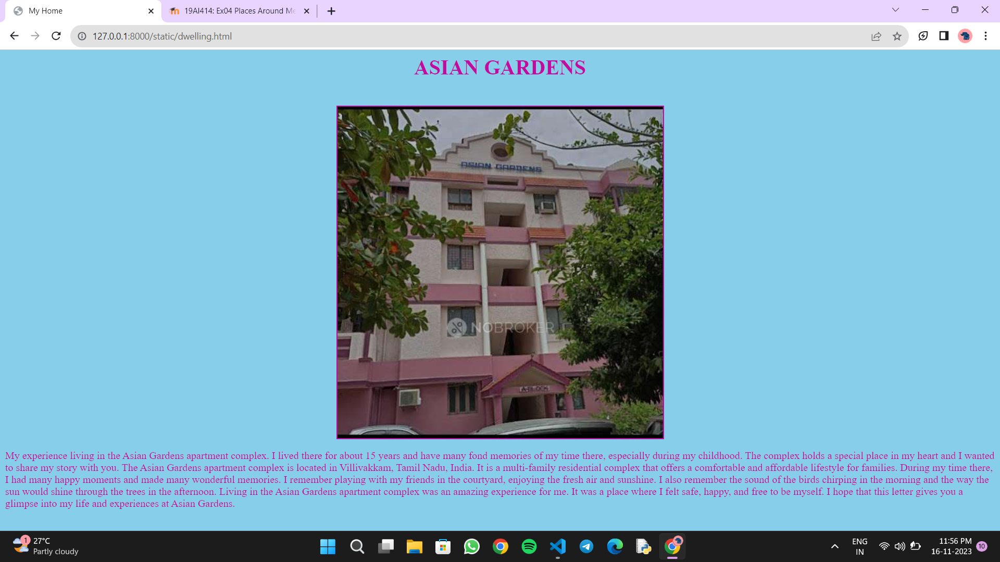

# Ex04 Places Around Me
## Date: 17/11/23
## AIM
To develop a website to display details about the places around my house.

## DESIGN STEPS

### STEP 1
Create a Django admin interface.

### STEP 2
Download your city map from Google.

### STEP 3
Using ```<map>``` tag name the map.

### STEP 4
Create clickable regions in the image using ```<area>``` tag.

### STEP 5
Write HTML programs for all the regions identified.

### STEP 6
Execute the programs and publish them.

## CODE
```
map.html

<html>
<head>
<title>MAP</title>
</head>
<body bgcolor="lavender">
<center>
<font size="6" color="red"><b>VILLIVAKKAM</b></font>
<br>
<h3 text="black">MAHA VIDYA J P (23013441)</h3>

<map name="MAP">
<area shape="rect" coords="950,270,1000,300" href="dwelling.html" title="Home">
<area shape="rect" coords="240,400,300,450" href="saravana stores.html" title="LEGEND NEW SARAVANA STORES">
<area shape="rect" coords="520,100,580,170" href="Wheels India.html" title="WHEELS INDIA">
<area shape="rect" coords="580,300,690,390" href="padiflyover.html" title="PADI FLYOVER">
<area shape="rect" coords="1350,200,1380,240" href="nadhamunitheatre.html" title="NADHAMUNI THEATRE">
</map>
</center>
</body>
</html>

dwelling.html

<html>
<head>
<title>My Home</title>
</head>
<body bgcolor="skyblue" text="charcoal">
<center>
<h1>ASIAN GARDENS</h1>
<br>

</center>
<p>
My experience living in the Asian Gardens apartment complex. I lived there for about 15 years and have many fond memories of my time there, especially during my childhood. The complex holds a special place in my heart and I wanted to share my story with you.
The Asian Gardens apartment complex is located in Villivakkam, Tamil Nadu, India. It is a multi-family residential complex that offers a comfortable and affordable lifestyle for families. During my time there, I had many happy moments and made many wonderful memories. I remember playing with my friends in the courtyard, enjoying the fresh air and sunshine. I also remember the sound of the birds chirping in the morning and the way the sun would shine through the trees in the afternoon.
Living in the Asian Gardens apartment complex was an amazing experience for me. It was a place where I felt safe, happy, and free to be myself. I hope that this letter gives you a glimpse into my life and experiences at Asian Gardens.
</p>
</body>
</html>

padiflyover.html

<html>
<head>
<title>Padi Flyover</title>
</head>
<body bgcolor="teal" text="white">
<center>
<h1>PADI FLYOVER</h1>
<br>

</center>
<p>
 The Padi Lucas Junction is the intersection of NH 205 (Madras-Tiruvallur High Road) and Inner Ring Road in the city of Chennai and is one of the most important junctions in the city. It is located in Anna Nagar north of Koyambedu Junction. An elevated rotary has been constructed at this junction as part of the NHDP by NHAI to ease the traffic congestion. It was built at a cost of ₹ 1,300 million and was opened for traffic on 20 February 2009.  The flyover was built to ease the traffic flow between Ambattur, Villivakkam, Red Hills, and Kolathur and the Kolkata Highway. The flyover is the main junction connecting Korattur, Koyambedu, Villivakkam, Thirumangalam areas in the city.
</p>
</body>
</html>

saravana stores.html

<html>
<head>
<title>Saravana Stores</title>
</head>
<body bgcolor="lightpink" text="brown">
<center>
<h1>NEW LEGEND SARAVANA STORES</h1>

<br>

</center>
<p>
The grand legacy of the New Saravana Stores Bramandamai, loved and adored by generations, brings a whole new dimension of shopping to Padi with the New Saravana Stores Legends The store has multiple luxurious floors of great variety for an international-level shopping experience but at affordable prices. I was impressed by the stunning silk and readymade textile designs, the latest and most trendy party wear, decorative items, plastic items, sofas, bureaus, bed and bedding to provisions, fruit and vegetable. The store has a huge collection of items and the prices are very reasonable.
The staff at the store were very helpful and courteous. They assisted me in finding the right products and provided excellent customer service. I was particularly impressed by their knowledge of the products and their willingness to go the extra mile to ensure customer satisfaction. Overall, I had a great shopping experience at the New Legend Saravana Stores and I would highly recommend it to anyone looking for quality products at affordable prices.
</p>
</body>
</html>

Wheels India.html

<html>
<head>
<title>Wheels India</title>
</head>
<body bgcolor="grey" text="black">
<center>
<h1>WHEELS INDIA</h1>
<br>

</center>
<p>
 The company has a rich history of engineering innovation and has been manufacturing wheels for commercial vehicles since 1962. The company has multiple world-class manufacturing locations and processes. I was impressed by the company's steadfast commitment to quality and its focus on sustainability. The staff at the Padi location were very knowledgeable and friendly. Wheels India is a leading manufacturer of wheels for commercial vehicles in India. The company has a wide range of products that cater to the needs of various industries, including automotive, railways, and renewable energy. The company has a strong focus on research and development, which has enabled it to create innovative products that meet the changing needs of its customers.The Padi location is one of the company's world-class manufacturing facilities. The facility is equipped with state-of-the-art machinery and equipment that enable the company to produce high-quality products at a competitive price. The staff at the facility are highly skilled and experienced, and they are committed to providing excellent customer service. During my visit to the Padi location, I was impressed by the company's commitment to sustainability. The company has implemented several initiatives to reduce its carbon footprint and conserve natural resources. The company has also implemented several measures to ensure the safety and well-being of its employees. Overall, I had a great experience at Wheels India in Padi. The company's commitment to quality, innovation, and sustainability is truly commendable. I would highly recommend Wheels India to anyone looking for high-quality products and excellent customer service.
</p>
</body>
</html>

nadhamunitheatre.html

<html>
<head>
<title>Nadhamuni Theatre</title>
</head>
<body bgcolor="cyan" text="voilet">
<center>
<h1>NADHAMUNI THEATRE</h1>
<br>

</center>
<p>
 Nadhamuni Theatre is a popular theatre located in High Court Colony, MTH Road, Villivakkam, Chennai. It has been serving the local community for several years and has become an integral part of the entertainment scene in the area. The theatre has one screen and offers a variety of movies in different languages, including Tamil, Hindi, and English. I recently visited the theatre and was impressed by the quality of the facilities and the services provided. The seating arrangements were comfortable, and the sound and picture quality were excellent. The staff was courteous and helpful, and the overall experience was enjoyable. However, I believe that there is still room for improvement. The theatre could benefit from more comfortable seating arrangements, especially for long-duration movies. The food and beverage options could also be expanded to include more variety and healthier options. Additionally, the theatre could consider offering more shows during the day to cater to the needs of different audiences. In conclusion, I would like to say that the Nadhamuni Theatre is a valuable asset to the community, and I hope that it continues to provide quality entertainment to the people of Villivakkam.
</p>
</body>
</html>

```

## OUTPUT





## RESULT
The program for implementing image maps using HTML is executed successfully.
